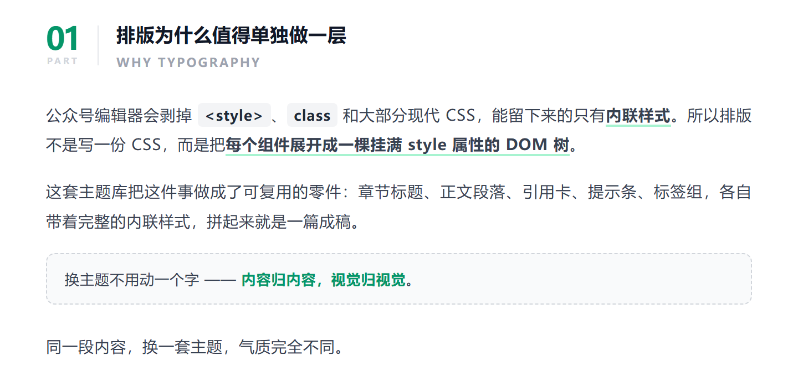
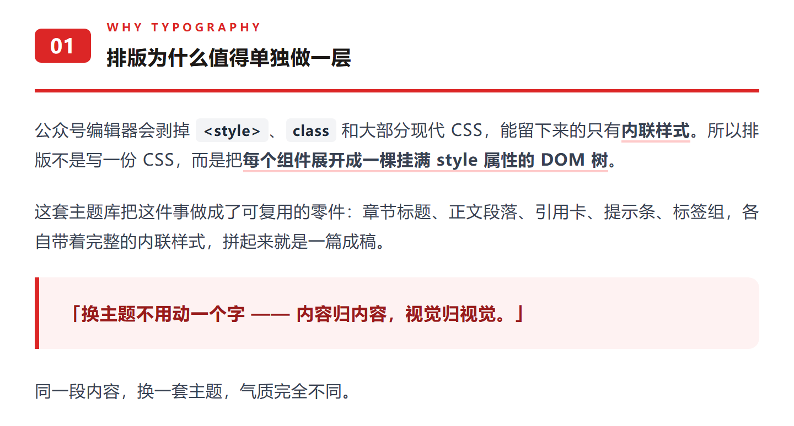
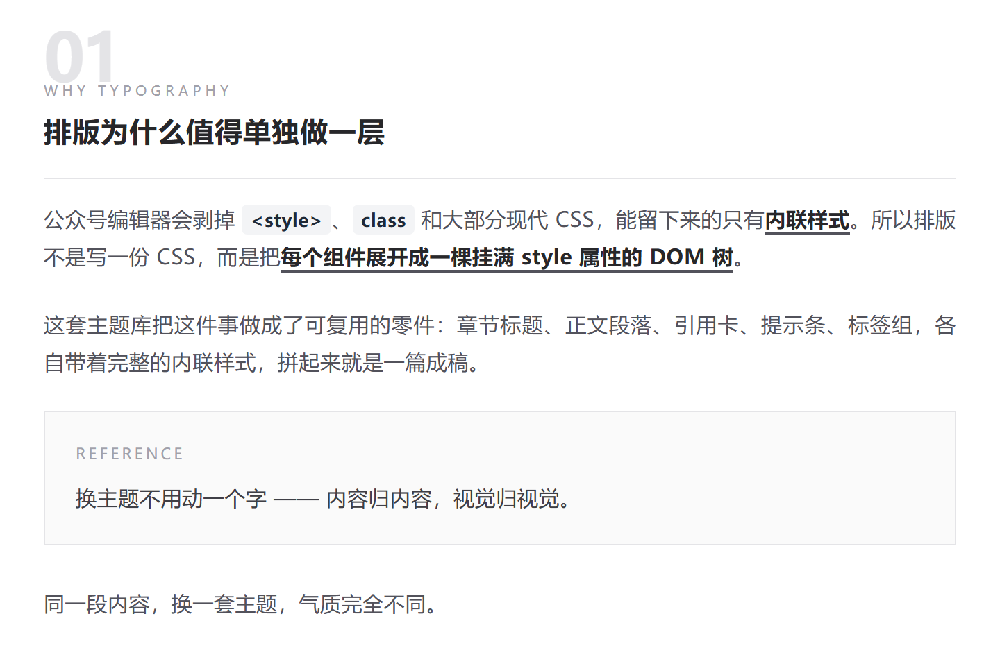
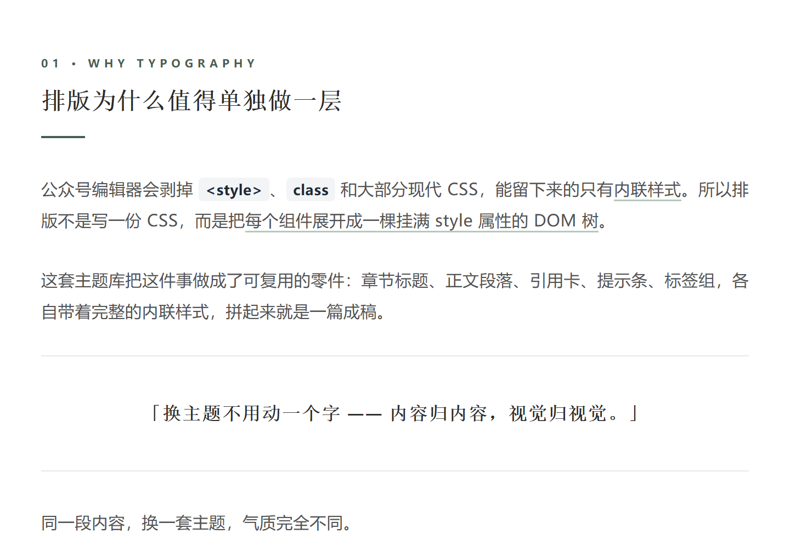
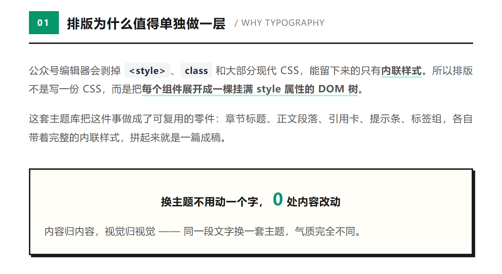
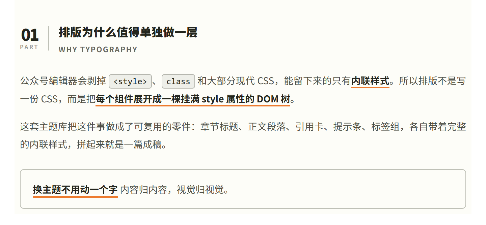

<div align="center">

# wechat-mp-publisher-skill

**微信公众号图文排版 + 发布工具**

6 套精选主题组件库把 Markdown 排成可直接粘贴进公众号编辑器的 HTML，再用微信官方 API 把图文推进草稿箱。排版、校验、配图、上传、成稿一条龙，剩下最后点一下「发表」的功夫给你。

[](https://github.com/SkyBiuBiu/wechat-mp-publisher-skill/actions/workflows/ci.yml)
[](#license)
[](CHANGELOG.md)

</div>

---

## 这个仓库是什么

两件事拼起来的：

| | 排版链路 | 发布链路 |
|---|---|---|
| **干什么** | 把内容排成公众号能吃的内联样式 HTML | 把排好的 HTML 连同图片、封面推进草稿箱 |
| **谁写的** | [isjiamu/gzh-design-skill](https://github.com/isjiamu/gzh-design-skill)（原创 **甲木 × 摸鱼小李**） | 本仓库 |
| **授权** | **AGPL-3.0**（原文见 [`LICENSE-gzh-design`](LICENSE-gzh-design)） | MIT（见 [`LICENSE`](LICENSE)） |

排版那一半是**原样搬过来的**——6 套主题组件库、通用组件库、主题生成器、归一化规则、
双关卡校验脚本、预览页，全部与上游逐字节一致，不改一行，方便日后跟着上游 re-sync。
要改组件，改上游；本仓库只在发布侧加东西。

> 上游是 AGPL-3.0：**署名与授权声明不得删除**，这部分内容的修改版、Fork、二次分发
> 须以 AGPL-3.0（或兼容协议）公开发布。详见 [License](#license)。

## 能做什么、不能做什么

微信接口权限由账号类型和认证状态决定，这不是配置能绕过的：

| 能力 | 可用范围 |
|---|---|
| 取凭证 / 传正文图 / 传封面素材 / **建草稿** | ✅ 绝大多数账号可用，个人未认证订阅号实测通过 |
| **API 正式发布**（`freepublish/submit`） | ❌ 仅认证账号。个人主体做不了微信认证，这个口子永久关闭 |

所以个人号的实际流程是：脚本把图文排好、图配好、素材传好、丢进草稿箱，你去后台点一下「发表」。排版和上传省掉了，剩下那一下点击。

认证服务号则可以一条命令直接推送给粉丝。

权限矩阵、实测记录和官方文档口径的差异见 [`references/wechat-api-reference.md`](references/wechat-api-reference.md)。

## 特点

### 排版侧

- **6 套精选主题组件库**：摸鱼绿（默认）/ 红白色系 / 石墨极简 / 留白禅意 / 摸鱼票据 / 橄榄手记。每套都是自成体系的厚组件库——设计变量表 + 20~41 个精细组件 + 文章类型配方表 + 完整骨架 + Markdown 映射规则。清单见 [`references/theme-index.md`](references/theme-index.md)。
- **通用增量组件库**：代码块（深/浅色，等宽不折行）、图片、GIF（带动图角标）、行内代码、左竖条小标题、药丸标签、待补素材占位——所有主题共用，套当前主题色即可。见 [`references/common-components.md`](references/common-components.md)。
- **智能排版**：章节自动编号（末章 `∞` / `///`）、**每段主动标 1–3 个关键词下划线**、从正文提炼引言卡与目录、作者签名去重合并、中文全角标点自动规范（代码块内原样保留）。
- **样式粘贴不掉**：所有样式内联、每个文字节点 `<span leaf="">` 包裹，规避 `<style>`/`<div>`/`class`/`grid`/`position` 等公众号会过滤的写法。
- **双关卡质量校验**：`component_lint.py`（组件库源头）+ `validate_gzh_html.py`（最终产物），构成可复现的「改→验→修」闭环。
- **一键复制预览页**：生成带「复制到公众号」按钮的预览页，点一下把渲染后的富文本复制到剪贴板，免手动全选。
- **内容输入**：Markdown 为主。Word(.docx) 用 `scripts/extract_docx.py` 转成 Markdown；PDF 与纯文本按 [`references/format-normalize.md`](references/format-normalize.md) 的规则先归一化再排版。
- **主题生成器**：不满足现成主题？用一句话描述或一张参考图，生成一套全新组件库并保存本地复用。

### 发布侧

- **正文图片自动换链**：正文写 `` 本地相对路径，脚本先传微信图床再替换 `src`。外链图会被微信静默过滤，别用。
- **mermaid 高清渲染**：`render_mermaid.py` 把 ```mermaid 围栏渲染成 PNG（本地 mmdc 优先，mermaid.ink 兜底），默认 `scale=3`，手机上看不糊。
- **发布前体检**：`preflight.py` 在本地把接口侧会翻车的地方拦掉——标题 32 字、作者 16 字、摘要 120 字、正文 1MB、图片体积格式、外链图、残留围栏与 mermaid 源码。分 P0 阻断 / P1 警告 / P2 建议三级，每条都给处理办法。
  （「正文 2 万字符」是文档口径，**2026-09-17 实测未强制**：4.5 万字符被接受且完整落库，所以只提示不阻断。）
- **零第三方依赖**：全部脚本只用 Python 标准库（`make_assets.py` 需 pillow），Windows / Linux 通用。
- **错误码翻成人话**：微信的 `errcode` 直接翻译成处置建议，`40164` 还会自动从报错里抠出被拒的 IP。
- **白名单等待器**：`watch_ip.py` 挂着轮询，白名单一生效自动接着建草稿，不用反复手点。
- **默认只建草稿**：正式发布需要显式确认；删除草稿必须给 `media_id`，防手滑。

## 六套主题

同一段内容，六套主题各排一遍。**下面每张图都是用该主题组件库里的真实组件渲染出来的**，
不是示意图——改一句文案、少一个组件，截图就会跟着变。

### 摸鱼绿 · `moyu-green`（默认）

绿色杂志风，卡片丰富、信息密度高。适合教程、测评、清单、工具盘点。



### 红白色系 · `red-white`

红底编号标签 + 红色实线，经典的编辑风力量感。适合深度分析、观点输出、争议话题。



### 石墨极简风 · `graphite-minimal`

超大水印编号压底、几乎全灰阶、橙色只在 ≤3 处锚点出现。适合设计、科技评论、专业观点。



### 留白禅意风 · `zen-whitespace`

衬线大字标题、上下细线框定的居中金句、大留白。适合禅意随笔、深度长文。



### 摸鱼票据风 · `moyu-ticket`

2px 黑描边 + 3px 硬阴影的票据隐喻，绿色只做点缀。适合工具对比、创意评测。



### 橄榄手记 · `olive-journal`

米白纸感 + 橄榄灰 + 橙色下划线，内刊手记的气质。适合案例复盘、深度评测。



---

全套主题的取舍（主色、字号、组件清单、适用场景）见 [`references/theme-index.md`](references/theme-index.md)；
每套组件库的完整组件与用法在 `references/theme-<标识>.md`。

**同一篇只用一套主题，不跨主题混用组件。**

**想要内置 6 套之外的风格**：走 [`references/theme-generator.md`](references/theme-generator.md) 的主题生成器——
按一句话描述或一张参考图生成 45~75 个区块的完整组件库，整页确认后转成标准主题库并登记，之后与内置主题完全同权。

> 配图怎么来的：`python tools/make_theme_previews.py`（同一段内容 × 六套主题，
> 用真实组件装配后拿本机 Chrome 无头截图）。改了组件库就该重跑，否则图会跟实现对不上。

## 安装

### 作为技能

仓库本身就是技能，clone 到技能目录即可：

```bash
# Linux / macOS
git clone https://github.com/SkyBiuBiu/wechat-mp-publisher-skill.git \
          ~/.workbuddy/skills/wechat-mp-publisher-skill
```

```powershell
# Windows PowerShell
git clone https://github.com/SkyBiuBiu/wechat-mp-publisher-skill.git `
          "$env:USERPROFILE\.workbuddy\skills\wechat-mp-publisher-skill"
```

装好后开一个新会话（技能列表在会话启动时加载），说「帮我把这篇文章发到公众号」就会触发。

更新：`cd ~/.workbuddy/skills/wechat-mp-publisher-skill && git pull`

### 作为命令行工具

不需要技能宿主，clone 到任意位置直接用：

```bash
git clone https://github.com/SkyBiuBiu/wechat-mp-publisher-skill.git
cd wechat-mp-publisher-skill
python scripts/publish.py --help
```

也可以从 [Releases](https://github.com/SkyBiuBiu/wechat-mp-publisher-skill/releases) 下载 zip 解压。

## 快速开始

```bash
cd wechat-mp-publisher-skill

# 1. 准备配置（必填的只有 appid 和 appsecret）
mkdir -p work/assets
cp assets/templates/config.example.json work/config.json
#    编辑 work/config.json：填 appid、appsecret、theme、title、digest

# 2. 选主题，读组件库
python scripts/render_mermaid.py --list-themes            # 看六套主题标识
#    然后读 references/theme-index.md → 选定主题 → 读
#    references/theme-<标识>.md 与 references/common-components.md

# 3. mermaid 先渲染成 PNG（正文里有 ```mermaid 才需要）
python scripts/render_mermaid.py article.md --theme moyu-green
#    → 产出 article.mermaid.md 与 assets/mermaid-*.png

# 4. 按组件库装配 work/article.html（纯 <section> 片段，内联样式 + <span leaf>）

# 5. 双关卡校验：产物关必须 ERROR 清零
python scripts/validate_gzh_html.py work/article.html

# 6. 一键复制预览页（浏览器打开点「复制到公众号」）
python scripts/wrap_preview.py work/article.html

# 7. 体检：不连微信、不需要凭证，先查接口侧硬约束
python scripts/preflight.py -c work/config.json

# 8. 自检：验证凭证与 IP 白名单，不发任何内容
python scripts/publish.py check -c work/config.json

# 9. 建草稿：图文进草稿箱，粉丝看不到（会先自动跑体检）
python scripts/publish.py draft -c work/config.json

# 10. 去 mp.weixin.qq.com → 内容与互动 → 草稿箱，人工确认后点「发表」
```

凭证和 IP 白名单怎么弄（最容易卡的一步）→ [`docs/manual.md`](docs/manual.md)
主题长什么样、怎么选 → [六套主题](#六套主题)

## 双关卡校验

```bash
python scripts/validate_gzh_html.py work/article.html
```

```
📋 公众号 HTML 合规校验: work/article.html
   span leaf 包裹: 218 处

⚠️  WARNING ×1（建议检查）:
   • 3 处正文疑似半角标点/英文引号，应改中文全角（代码块内不计）。例：「好,」；「"引用"」

✅ 无致命问题，可粘贴（warning 请人工确认）
```

ERROR 清零、半角标点 WARNING 也修到 0 才算完成——半角标点是实际使用中最高频的返工点。改过组件库时还要跑源头关：

```bash
python scripts/component_lint.py .
```

## 发布前体检

```bash
python scripts/preflight.py -c work/config.json
```

```
== 发布前体检（接口侧硬约束）==

P0 · 阻断 · 1 项
------------------------------------------------------------------
  [WX028] 第 2 张图是外链图，会被静默过滤
        现象：https://example.com/a.png
        处理：改成本地相对路径，脚本会先上传到微信图床再换 src

P1 · 警告 · 1 项
------------------------------------------------------------------
  [WX022] 正文超过 2 万字符（文档口径，实测未强制）
        现象：当前 45259 字符，超出 25259 字
        处理：接口目前接受且不截断，可直接发；若接口回字数类错误，再按主题库的
             精简组件重排，或把长代码/长表格转成图片、拆篇

P2 · 建议 · 2 项
------------------------------------------------------------------
  [WX202] 未配置原文链接
        处理：留空则文末不显示「阅读原文」；发布链路跳不通时建议留空
  [WX203] 评论未开启
        处理：需要互动时设 need_open_comment=1

      正文 45259 字符 [##############] 45259/20000（超出文档口径 25259 字，见 WX022）
      纯文本 4372 字 | 图片 2 张 | 封面 49 KB（1800x766）
------------------------------------------------------------------
统计：P0×1  P1×1  P2×2
结果：不可发布 —— 先修 P0。1 项阻断会让微信直接报错或内容残缺。
      排版类问题不在这里查：跑 scripts/validate_gzh_html.py <正文.html>
```

有 P0 时退出码为 1，`draft` 会就地停下（此时还没发任何请求）。`--warn-only` 只报告不拦截，`--json` 给 CI 用。

三级的分工：**P0** 微信一定报错或内容一定坏；**P1** 发得出去但图会丢、版式会塌；
**P2** 不影响发布。检查项与判定依据（官方硬约束 / 文档口径实测未强制 / 实测行为 / 经验阈值）
逐条登记在 [`references/wechat-api-reference.md`](references/wechat-api-reference.md) 第六节。

## 命令参考

```bash
python scripts/publish.py <子命令> [参数]
```

| 子命令 | 作用 |
|---|---|
| `check` | 验凭证 + 白名单，不发内容。动手前先跑这个 |
| `preflight` | 只做发布前体检（接口侧），不连微信、不需要凭证 |
| `draft` | 建草稿（推荐默认档）：体检 → 取 token → 正文图换链 → 传封面素材 → 建草稿 → 回查确认 |
| `publish` | 建草稿并立即正式发布。粉丝会收到推送，不可撤回 |
| `publish --media-id <id> -y` | 发布草稿箱里已有的一篇，不重复建稿 |
| `list` / `list --full` | 列出草稿箱（`--full` 出完整 media_id） |
| `delete --media-id <id> -y` | 删除指定草稿（破坏性，必须显式给 id） |
| `token -f` | 强制刷新 access_token（遇到 `40001` 时用） |

通用参数：

| 参数 | 说明 |
|---|---|
| `-c, --config <路径>` | 配置文件。默认按「当前目录 → 技能目录」查找 `config.json` |
| `-f, --force` | 忽略本地 token 缓存，强制重新获取 |
| `-y, --yes` | 跳过交互确认（仅脚本化场景使用） |
| `--no-preflight` | `draft` 前不跑体检（不建议） |
| `--warn-only` | 配合 `preflight`：有 P0 也返回 0 |
| `--json` | 配合 `preflight`：输出结构化 JSON |

辅助脚本：

| 脚本 | 作用 |
|---|---|
| `scripts/render_mermaid.py` | 排版前把 ```mermaid 渲染成 PNG。`--theme` 取主题配色，`--list-themes` 查标识，`--no-remote` 禁用在线渲染 |
| `scripts/validate_gzh_html.py` | **产物关**：禁用标签 / `<span leaf>` 包裹 / 半角标点 |
| `scripts/component_lint.py` | **源头关**：扫组件库反模式（`white-space:pre`、正文虚线框、平台禁用项） |
| `scripts/wrap_preview.py` | 生成带「复制到公众号」按钮的预览页 |
| `scripts/extract_docx.py` | Word(.docx) → Markdown |
| `scripts/preflight.py` | 发布前体检：P0/P1/P2 三级清单，`--json` / `--warn-only` / `--quiet` |
| `scripts/watch_ip.py` | 轮询等白名单生效，通了自动建草稿。`-i 秒` 调间隔，`-m 次数` 限次，`--no-preflight` 透传 |
| `scripts/make_assets.py` | 生成封面（900×383），需 `pillow`；配色跟 `config.json` 的 `theme` 走，`--theme` / `--dark` 可覆盖，`--title/--subtitle/--date` 可配 |
| `scripts/validate_skill.py` | 仓库自检：结构 / frontmatter / 版本 / 语法 / 密钥 / 引用 / 主题注册表 / 组件库源头关 |
| `scripts/build_zip.py` | 打分发 zip 到 `dist/`，自动排除密钥与本机状态 |

## 配置项

`config.json` 由 `assets/templates/config.example.json` 复制而来：

| 字段 | 必填 | 说明 |
|---|---|---|
| `appid` | ✅ | 微信开发者平台 → 公众号 → 基础信息 → 开发密钥 |
| `appsecret` | ✅ | 同上，只显示一次，当场存好 |
| `author` | | 作者，上限 16 字 |
| `theme` | | 排版用的主题标识（`moyu-green` / `red-white` / `graphite-minimal` / `zen-whitespace` / `moyu-ticket` / `olive-journal`）。纯记录 + 给 mermaid 取色用；排版本身由组件库决定 |
| `mermaid.remote` | | mermaid 渲染走 mermaid.ink 在线服务（默认 `true`）；涉密图表装 mmdc 后设 `false` |
| `mermaid.scale` | | 渲染倍率，默认 `3`（与 width 共同决定输出像素，越高越清晰） |
| `mermaid.width` | | 渲染基准宽度，默认 `1200`（输出宽 ≈ scale × width） |
| `mermaid.dir` | | 渲染产物目录，默认 `assets` |
| `article.title` | ✅ | 标题，上限 32 字 |
| `article.digest` | | 摘要，上限 120 字；留空自动抓正文前 54 字 |
| `article.content_file` | ✅ | 正文 HTML，路径相对配置文件所在目录 |
| `article.cover_file` | ✅ | 封面图，走永久素材接口，建议 900×383（2.35:1） |
| `article.content_source_url` | | 文末「阅读原文」跳转地址，留空不显示 |
| `need_open_comment` | | `1` 开评论 |
| `only_fans_can_comment` | | `1` 仅粉丝可评 |

凭证也可以不写配置文件，用环境变量：`WECHAT_MP_APPID` / `WECHAT_MP_APPSECRET`。

## 目录结构

```
wechat-mp-publisher-skill/
├── SKILL.md                        # 技能入口（排版 + 发布两条链路的工作流）
├── README.md                       # 本文件
├── CHANGELOG.md                    # 版本变更记录
├── CONTRIBUTING.md                 # 开发约定与发版流程
├── LICENSE                         # MIT（本仓库自有部分）
├── LICENSE-gzh-design              # AGPL-3.0（上游排版链路授权原文）
├── VERSION                         # 当前版本号
├── scripts/
│   ├── publish.py                  # 发布主脚本：微信 API 全链路（零依赖）
│   ├── preflight.py                # 发布前体检：接口侧硬约束
│   ├── render_mermaid.py           # mermaid → PNG 预渲染
│   ├── make_assets.py              # 封面生成（需 pillow）
│   ├── watch_ip.py                 # 白名单生效轮询
│   ├── validate_gzh_html.py        # 产物关（上游）
│   ├── component_lint.py           # 源头关（上游）
│   ├── wrap_preview.py             # 一键复制预览页（上游）
│   ├── extract_docx.py             # docx → markdown（上游）
│   ├── validate_skill.py           # 仓库自检
│   └── build_zip.py                # 分发包打包
├── references/
│   ├── theme-index.md              # 6 套主题索引（单一来源）
│   ├── theme-*.md                  # 6 套主题组件库
│   ├── common-components.md        # 跨主题通用组件（代码块/图片/小标签）
│   ├── theme-generator.md          # 自定义主题生成器
│   ├── format-normalize.md         # docx/pdf/纯文本 → Markdown
│   ├── eval-cases.md               # 触发用例与回归核对
│   └── wechat-api-reference.md     # 接口字段约束、权限矩阵、错误码全表
├── docs/
│   ├── manual.md                   # 完整操作手册：后台路径、白名单排查、报错表
│   └── images/                     # README 的主题样例配图（不进分发包）
├── tools/
│   └── make_theme_previews.py      # 生成上面的样例配图（需本机 Chrome，不进分发包）
├── assets/
│   ├── preview-template.html       # 预览页外壳（带复制按钮）
│   ├── sample-article.md           # 演示输入
│   └── templates/config.example.json
└── .github/                        # CI、Release 工作流、Issue / PR 模板
```

## 常见问题

**`40164` 不在白名单** —— 加调用方公网 IPv4 出口地址。`curl ifconfig.me` 可能返回 IPv6，微信不认，用 `curl -4 ipv4.icanhazip.com`。改完通常要管理员扫码确认，且有生效延迟。挂着 `watch_ip.py` 等，别反复手点。

**`48001` 接口未授权** —— 账号类型限制，重试无意义。个人号 `freepublish` 永久不可用，转后台手动发布。

**`40001` 之前是好的** —— token 被别处刷新导致本地缓存失效，`python scripts/publish.py token -f`。

**粘贴到公众号后样式全丢** —— 漏了 `<span leaf="">` 包裹。跑 `validate_gzh_html.py` 定位具体位置。

**正文图片不显示** —— 用了外链图。改成 `` 本地相对路径，脚本会自动换链。

**mermaid 图里印出了 `<br data-page-node-id="…">`** —— 本地编辑器注入的记账属性污染了 mermaid 源码，它会把 `<br/>` 当字面文本画出来。这类污染**不报错、只画错**，渲染完一定要看一眼 PNG。

**提示正文超过 2 万字符（WX022）** —— 先别急着删内容：这条**只是提示，不阻断**。官方文档写 `content` 必须少于 2 万字符，但 2026-09-17 实测 45258 字符被 `draft/add` 接受、`draft/get` 回查 45390 字符且尾部一致，即完整落库未截断。主题组件库的内联样式写法体积天然是纯文本的 5~10 倍，压到 2 万以下等于放弃版式，所以照发即可。真被接口回字数错误时再压：mermaid 转 PNG、长表格重排、按章节拆成系列。

> 顺带一提，别用 `wc -c` 判长度：它数 UTF-8 字节（中文按 3 字节计），会把 1.6 万字的文章显示成 2.1 万。以 `preflight.py` 的 `len(html)` 输出为准。

**体检报 WX029 说图片不存在** —— 组件里引用了示例图路径。放上自己的图，或把那一块整段删掉。

**发布提交成功但后台看不到** —— `errcode=0` 只代表任务提交成功，发布有延迟，最终结果走微信服务端事件推送。

完整排查清单和错误码表 → [`docs/manual.md`](docs/manual.md) 与 [`references/wechat-api-reference.md`](references/wechat-api-reference.md)

## 安全

- `config.json` 和 `.token_cache.json` 含密钥，已在 `.gitignore` 里，CI 还有 gitleaks 兜底。
- AppSecret 在微信平台不存储、不显示，忘了只能重置，重置会让旧密钥立即失效。
- 如果 AppSecret 曾在对话、日志或截图里明文出现过，正式使用前到开发者平台重置。
- 脚本默认只建草稿。正式发布不可撤回，执行前需明确知情。

## 发版

遵循[语义化版本](https://semver.org/lang/zh-CN/)，变更记录在 [`CHANGELOG.md`](CHANGELOG.md)。

```bash
# 改完先自检
python scripts/validate_skill.py

# 本地验证打包链路
python scripts/build_zip.py

# 发版：改 VERSION 与 CHANGELOG → 打 tag → 推
git commit -am "chore(release): v0.5.0"
git tag -a v0.5.0 -m "v0.5.0"
git push origin main --tags
```

推 tag 会触发 `release.yml`：跑自检、校验 tag 与 `VERSION` 一致、打包 zip、挂到 Release。`ci.yml` 在每次 push / PR 时跑自检 + gitleaks + 打包验证。

开发约定见 [`CONTRIBUTING.md`](CONTRIBUTING.md)。

## License

本仓库分两部分：

- **本仓库自有部分**（发布链路：`scripts/publish.py`、`preflight.py`、`render_mermaid.py`、`make_assets.py`、`watch_ip.py`、`validate_skill.py`、`build_zip.py`、`tools/`、`docs/`、`references/wechat-api-reference.md`）—— [MIT](LICENSE) © 2026 Sky (SkyBiuBiu)
- **排版链路**（`references/theme-*.md`、`common-components.md`、`theme-generator.md`、`format-normalize.md`、`eval-cases.md`、`theme-index.md`、`assets/preview-template.html`、`assets/sample-article.md`、`scripts/validate_gzh_html.py`、`component_lint.py`、`wrap_preview.py`、`extract_docx.py`）—— 来自 [**isjiamu/gzh-design-skill**](https://github.com/isjiamu/gzh-design-skill)，原创 **甲木 × 摸鱼小李**，授权 **AGPL-3.0**，原文见 [`LICENSE-gzh-design`](LICENSE-gzh-design)。

> 排版链路的署名与授权声明**不得删除**；这部分内容的修改版、Fork、二次分发须以 AGPL-3.0（或兼容协议）公开发布，即使只作为网络服务提供也要开源。
